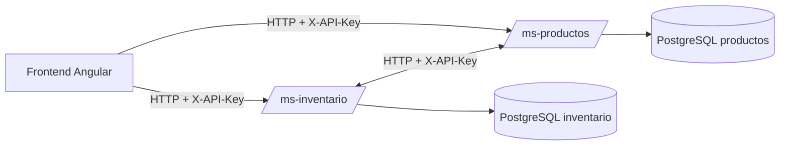
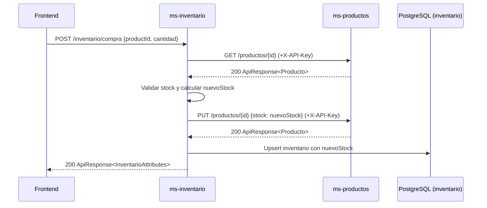

# Monorepo: Frontend + Microservicios

## Descripción General
- Monorepo que incluye:
  - `frontend/` (Angular)
  - `ms-productos/` (Spring Boot: catálogo de productos)
  - `ms-inventario/` (Spring Boot: stock y compras)
  - `docker-compose.yml` para orquestación local
- Comunicación entre microservicios autenticada con `X-API-Key`.
- Base de datos PostgreSQL para persistencia consistente.

## Estructura
- `frontend/`: aplicación Angular con interceptor HTTP que agrega `X-API-Key`.
- `ms-productos/`: gestión de productos (CRUD, consulta).
- `ms-inventario/`: cálculo y actualización de stock, compra y sincronización con productos.
- `docker-compose.yml`: servicios `postgres`, `ms-productos`, `ms-inventario`.

## Requisitos Técnicos
## Frontend
- Node.js 20+, npm 10+
- Angular 21 y Angular CLI ^21.0.1.
- TypeScript ~5.9 y RxJS ~7.8.
- SSR opcional con Express (`@angular/ssr`).
- Pruebas: Vitest

## Backend
- Java 21, Maven (Backend).
- Docker y Docker Compose.
- Pruebas: JUnit/Mockito/JaCoCo.

## ¿Por qué PostgreSQL?
- Transacciones ACID y consistencia fuerte.
- Integración directa con Hibernate/JPA.
- Tipos avanzados y rendimiento para cargas OLTP típicas.
- Despliegue simple en contenedores.

## Seguridad entre Servicios (API Key)
- Cabecera `X-API-Key` en todas las llamadas internas.
- Frontend: interceptor agrega la cabecera automáticamente.
- Inventario → Productos: cliente HTTP agrega `X-API-Key` en `GET` y `PUT`.

## Resiliencia: Timeouts y Reintentos
- Cliente HTTP con timeouts configurables.
- Reintentos ante fallos temporales (5xx, timeouts) con backoff.
- Validaciones de negocio: stock insuficiente retorna error controlado.

## Puesta en Marcha
- Preparar `.env` en la raíz (ejemplo):
```
API_KEY=app-secret
SPRING_DATASOURCE_URL=jdbc:postgresql://postgres:5432/appdb
SPRING_DATASOURCE_USERNAME=app
SPRING_DATASOURCE_PASSWORD=app
PRODUCTOS_SERVICE_URL=http://ms-productos:8081
```
- Construcción y arranque:
```
docker compose build --no-cache ms-productos ms-inventario
docker compose up -d postgres ms-productos ms-inventario
```
- Frontend:
```
cd frontend
npm install
npm run start
```
- SSR opcional:
```
npm run build
npm run serve:ssr:frontend
```

## Pruebas y Cobertura
- Backend: `./mvnw.cmd clean test` en cada microservicio.
- Imágenes Docker copian cobertura a `/app/coverage`.
- Copiar reporte a host:
```
docker cp ms-productos:/app/coverage ./coverage/ms-productos
docker cp ms-inventario:/app/coverage ./coverage/ms-inventario
```

## Arquitectura


## Diagrama de Secuencia (Compra)


## Endpoints Principales
- ms-productos:
  - `GET /productos`, `GET /productos/{id}`, `POST /productos`, `PUT /productos/{id}`, `DELETE /productos/{id}`
- ms-inventario:
  - `GET /inventario/{productId}/stock`, `POST /inventario/compra`

## Referencias de Código
- Interceptor de API Key: `frontend/src/app/shared/api.interceptor.ts:1–10`
- Registro de interceptor: `frontend/src/app/app.config.ts:9–15`
- Cliente Inventario→Productos: `ms-inventario/src/main/java/com/app/inventario/client/ProductoCliente.java:34–50, 72–91`
- Servicio Inventario: `ms-inventario/src/main/java/com/app/inventario/service/InventarioService.java:23–85`
- Servicio Productos: `ms-productos/src/main/java/com/app/productos/service/ProductoService.java:20–52`
