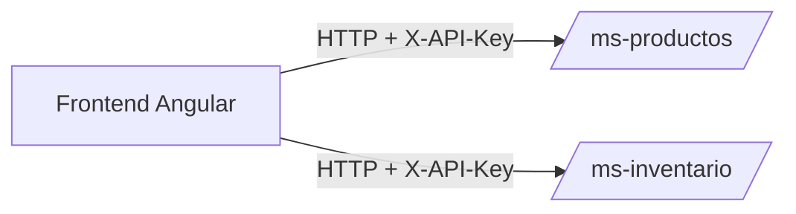
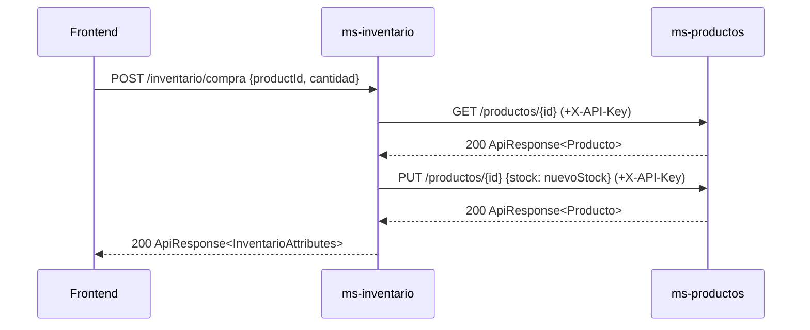

# Frontend

This project was generated using [Angular CLI](https://github.com/angular/angular-cli) version 21.0.1.

## Descripción
- Aplicación Angular que consume `ms-productos` y `ms-inventario`.
- Usa `HttpClient` con un interceptor que agrega autenticación por API Key.

## Requisitos Técnicos
- Node.js 20+, npm 10+.
- Angular 21 (standalone), SSR opcional con Express (`src/server.ts`).
- Comunicación HTTP con los microservicios en `http://localhost:8081` y `http://localhost:8083`.
- Pruebas: `vitest` integradas con Angular CLI.

## Autenticación entre microservicios (API Key)
- El frontend agrega la cabecera `X-API-Key` en todas las peticiones.
- Interceptor: `frontend/src/app/shared/api.interceptor.ts:1–10`.
- Registro del interceptor: `frontend/src/app/app.config.ts:9–15`.

## Manejo de Errores, Reintentos y Timeouts
- Listeners globales de errores del navegador: `frontend/src/app/app.config.ts:9–12`.
- Reintentos y timeouts pueden añadirse vía RxJS (`retry`, `timeout`) en servicios HTTP:
  - Productos: `frontend/src/app/api/productos.service.ts:1–23`.
  - Inventario: `frontend/src/app/api/inventario.service.ts:1–23`.

## Despliegue
- Instalar dependencias: `npm install`.
- Levantar backend con Docker Compose y verificar puertos `8081` y `8083` disponibles.
- Iniciar frontend:
  - `npm run start` para dev (`http://localhost:4200`).
  - `npm run build` y `npm run serve:ssr:frontend` para SSR (`http://localhost:4000`).

## Arquitectura


## Diagrama de Secuencia (Compra)


## Development server

To start a local development server, run:

```bash
ng serve
```

Once the server is running, open your browser and navigate to `http://localhost:4200/`. The application will automatically reload whenever you modify any of the source files.

### SSR opcional
- Construir SSR: `npm run build`
- Servir SSR: `npm run serve:ssr:frontend` (escucha en `http://localhost:4000`).

## Code scaffolding

Angular CLI includes powerful code scaffolding tools. To generate a new component, run:

```bash
ng generate component component-name
```

For a complete list of available schematics (such as `components`, `directives`, or `pipes`), run:

```bash
ng generate --help
```

## Building

To build the project run:

```bash
ng build
```

This will compile your project and store the build artifacts in the `dist/` directory. By default, the production build optimizes your application for performance and speed.

## Running unit tests

To execute unit tests with the [Vitest](https://vitest.dev/) test runner, use the following command:

```bash
ng test
```

## Running end-to-end tests

For end-to-end (e2e) testing, run:

```bash
ng e2e
```

Angular CLI does not come with an end-to-end testing framework by default. You can choose one that suits your needs.


## Additional Resources

For more information on using the Angular CLI, including detailed command references, visit the [Angular CLI Overview and Command Reference](https://angular.dev/tools/cli) page.
