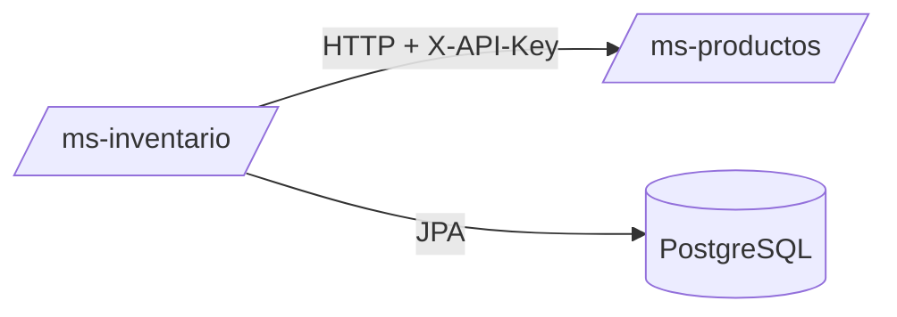
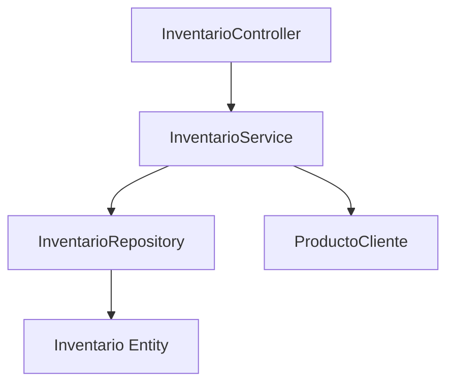
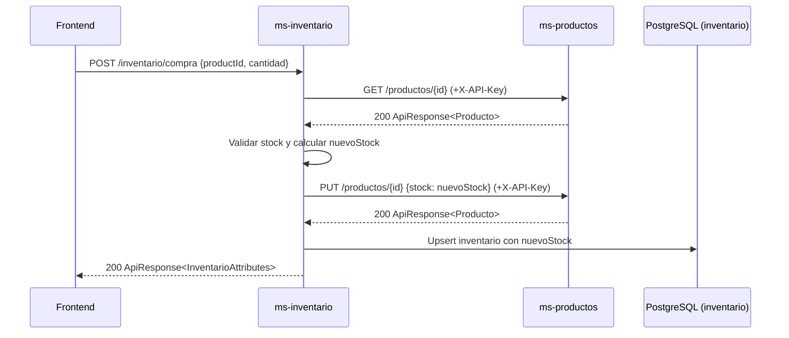

# ms-inventario

## Descripción
- Microservicio responsable de consultar stock y procesar compras actualizando inventario local y remoto (productos).
- Expone API REST bajo `http://localhost:8083/inventario`.

## Requisitos Técnicos
- Java 21, Spring Boot 4.x, JPA/Hibernate.
- Cliente HTTP: `RestTemplate` con timeouts.
- Reintentos: `spring-retry`.
- Base de datos: PostgreSQL.
- Contenedores: Docker y Docker Compose.
- Pruebas: JUnit 5, Mockito, Spring Test, JaCoCo.

## ¿Por qué PostgreSQL?
- Transacciones ACID y consistencia para operaciones de stock.
- Integración nativa con Hibernate, soporte para índices eficientes.
- Confiable y ampliamente soportado en contenedores y cloud.

## Autenticación entre microservicios (API Key)
- Este servicio llama a ms-productos enviando la cabecera `X-API-Key`.
- Configuración por variables:
  - `productos.service.api.key` (`API_KEY`) y `productos.service.url` (`PRODUCTOS_SERVICE_URL`).
  - `ms-inventario/src/main/resources/application.properties:12–18`.
- Construcción de la cabecera y llamada HTTP:
  - `ms-inventario/src/main/java/com/app/inventario/client/ProductoCliente.java:34–50, 72–91`.

## Manejo de Errores, Reintentos y Timeouts
- Timeouts del cliente HTTP:
  - `ms-inventario/src/main/java/com/app/inventario/InventarioServiceApplication.java:15–23`.
- Reintentos automáticos ante `ResourceAccessException`/`5xx`:
  - `@Retryable` con `maxAttempts=3` y `backoff=1000ms` en `ProductoCliente`.
  - `ms-inventario/src/main/java/com/app/inventario/client/ProductoCliente.java:27–31`.
- Validación de stock insuficiente y errores coherentes en servicio de negocio:
  - `ms-inventario/src/main/java/com/app/inventario/service/InventarioService.java:57–61, 67–74`.

## Endpoints Principales
- `GET /inventario/{productId}/stock`: devuelve stock actual.
- `POST /inventario/compra`: procesa compra y sincroniza stock.

## Variables de Entorno
- `SPRING_DATASOURCE_URL`, `SPRING_DATASOURCE_USERNAME`, `SPRING_DATASOURCE_PASSWORD`, `SPRING_JPA_HIBERNATE_DDL_AUTO`.
- `SERVER_PORT=8080`.
- `API_KEY=app-secret`.
- `PRODUCTOS_SERVICE_URL=http://ms-productos:8081`.

## Pruebas y Cobertura
- Ejecutar local: `./mvnw.cmd clean test`.
- En Docker: la imagen se construye con `mvn clean verify` y copia cobertura a `/app/coverage`.
- Reporte local: `target/site/jacoco/index.html`.

## Arquitectura

## Componentes

## Despliegue
- Clonar el repositorio.
- Construir e iniciar con Docker Compose:
  - `docker compose build --no-cache ms-inventario`
  - `docker compose up -d ms-inventario`
- Verificar logs: `docker compose logs ms-inventario`.
- Probar:
  - `GET http://localhost:8083/inventario/{id}/stock`
  - `POST http://localhost:8083/inventario/compra` con body `{ productId, cantidad }`.
- Cobertura (opcional): copiar desde el contenedor `docker cp ms-inventario:/app/coverage ./coverage/ms-inventario`.

## Diagrama de Secuencia (Compra)

## Referencias de Código
- Arranque y `RestTemplate`: `ms-inventario/src/main/java/com/app/inventario/InventarioServiceApplication.java:15–23`.
- Controlador: `ms-inventario/src/main/java/com/app/inventario/controller/InventarioController.java:17–44`.
- Servicio: `ms-inventario/src/main/java/com/app/inventario/service/InventarioService.java:23–85`.
- Cliente HTTP: `ms-inventario/src/main/java/com/app/inventario/client/ProductoCliente.java:15–99`.
