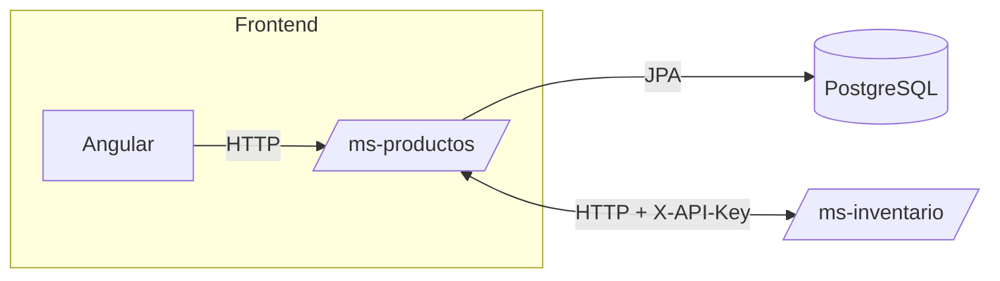
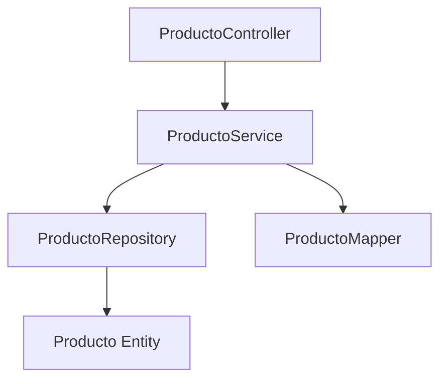
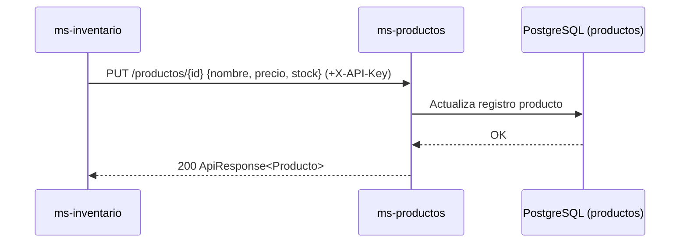

# ms-productos

## Descripción
- Microservicio responsable de gestionar productos: creación, consulta, actualización y eliminación.
- Expone API REST bajo `http://localhost:8081/productos`.

## Requisitos Técnicos
- Java 21, Spring Boot 4.x, JPA/Hibernate, MapStruct, OpenAPI.
- Base de datos: PostgreSQL.
- Contenedores: Docker y Docker Compose.
- Pruebas: JUnit 5, Mockito, Spring Test, JaCoCo.

## ¿Por qué PostgreSQL?
- Motor relacional robusto con transacciones ACID y consistencia fuerte.
- Soporte para tipos avanzados (p. ej. `JSONB`) y extensiones.
- Excelente integración con Hibernate y herramientas de ecosistema Java.
- Rendimiento y fiabilidad en escenarios OLTP típicos de catálogo y stock.
- Fácil despliegue en contenedores y entornos cloud.

## Autenticación entre microservicios (API Key)
- Las llamadas entre microservicios utilizan la cabecera `X-API-Key`.
- Documentación del esquema de seguridad en `ms-productos/src/main/java/com/app/productos/config/OpenApiConfig.java:1`.
- El cliente del microservicio de inventario agrega la cabecera al comunicarse con este servicio.

## Manejo de Errores, Reintentos y Timeouts
- Respuestas 404 controladas con `ResponseStatusException` cuando el producto no existe:
  - `ms-productos/src/main/java/com/app/productos/service/ProductoService.java:26–30, 38–45, 47–52`.
- Reintentos y timeouts se configuran en el cliente del microservicio de inventario (ver README de ms-inventario).

## Endpoints Principales
- `GET /productos`: lista productos.
- `GET /productos/{id}`: obtiene producto; 404 si no existe.
- `POST /productos`: crea producto.
- `PUT /productos/{id}`: actualiza producto.
- `DELETE /productos/{id}`: elimina producto.

## Variables de Entorno
- `SPRING_DATASOURCE_URL`, `SPRING_DATASOURCE_USERNAME`, `SPRING_DATASOURCE_PASSWORD`, `SPRING_JPA_HIBERNATE_DDL_AUTO`.
- `SERVER_PORT=8081`.

## Pruebas y Cobertura
- Ejecutar local: `./mvnw.cmd clean test`.
- En Docker: la imagen se construye con `mvn clean verify` y copia cobertura a `/app/coverage`.
- Reporte local: `target/site/jacoco/index.html`.

## Arquitectura

## Componentes

## Despliegue
- Clonar el repositorio.
- Construir e iniciar con Docker Compose:
  - `docker compose build --no-cache ms-productos`
  - `docker compose up -d ms-productos`
- Verificar logs: `docker compose logs ms-productos`.
- Probar:
  - `GET http://localhost:8081/productos`
  - `POST http://localhost:8081/productos` con body JSON.
- Cobertura (opcional): copiar desde el contenedor `docker cp ms-productos:/app/coverage ./coverage/ms-productos`.

## Diagrama de Secuencia (Actualización vía ms-inventario)

## Referencias de Código
- Arranque: `ms-productos/src/main/java/com/app/productos/ProductoServiceApplication.java:1`.
- Controlador: `ms-productos/src/main/java/com/app/productos/controller/ProductoController.java:37–78`.
- Servicio: `ms-productos/src/main/java/com/app/productos/service/ProductoService.java:20–52`.
- Mapper: `ms-productos/src/main/java/com/app/productos/mapper/ProductoMapper.java:1`.
